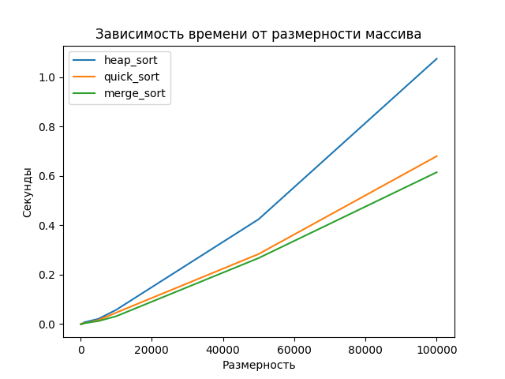

# ЛР1

Пирамидальная сортировка 
Быстрая сортировка 
Сортировка слиянием

Массив данных о членах сборной команды по футболу: страна, ФИО футболиста, название клуба, амплуа (вратарь,  защитник, полузащитник, нападающий), 
количества матчей,  проведенных за сборную, количество забитых за сборную  мячей (для вратарей – пропущенных со знаком «минус»)  
(сравнение по полям – количество матчей, ФИО, количество мячей (по убыванию))

1) Реализовать на высокоуровневом языке программирования сортировки для массива объектов в соответствии с вариантом. 
2) Перегрузить операторы сравнения (>, <, >=, <=) для сравнения объектов. Правила сравнения указаны в варианте.
3) Входные данные для сортировки массива обязательно считывать из внешних источников: текстовый файл, файлы MS Excel, MS Access, 
данные из СУБД (любое на выбор). Выходные данные (отсортированный массив) записывать в файл.
4) Выбрать 7-10 наборов данных для сортировки размерности от 100 и более (но не менее 100000). 
Засечь (программно) время сортировки каждым алгоритмом. По полученным точкам построить графики зависимости времени сортировки от размерности массива для каждого из алгоритмов сортировки на одной оси координат. Сделать вывод о том, в каком случае, какой из методов лучше применять.
5) Сделать отчет, состоящий из:
    -документации к коду работы, сгенерированную с помощью case средства (doxygen, sphinx, etc);
    -ссылку на исходный код программы в репозитории;
    -графики времени сортировок. 

Было взято 7 датасетов с размерностями: 100, 500, 1000, 5000, 10000, 50000, 100000

Из графика следует, что если массив небольшого размера, нет особой разницы, какую сортировку использовать. Однако с увеличением размерности данных становится очевидным, что сортировка слиянием быстрее остальных, причем наиболее существенная разница с пирамидальной сортировкой.